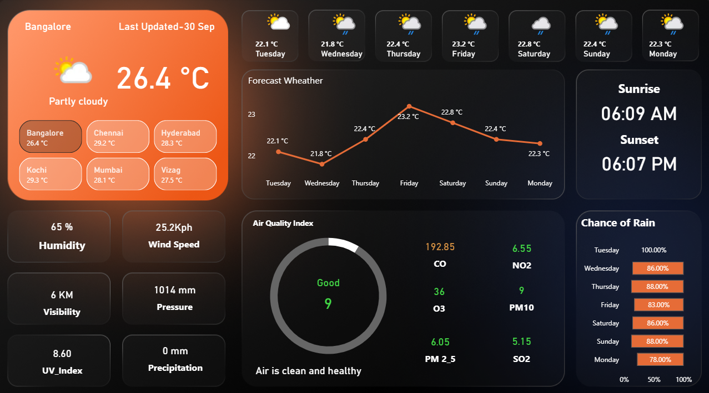
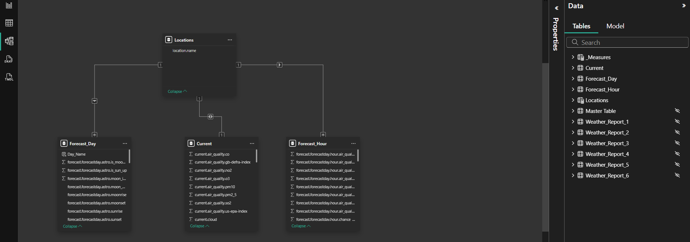

# 🌤 Weather Dashboard – Power BI Project

## 📌 Project Overview
The **Weather Dashboard** is an interactive Power BI report designed to provide real-time and forecasted weather insights.  
It integrates with the **Weather API** to display current weather, a 7-day forecast, air quality index, and city-wise comparisons.  
This dashboard helps users monitor weather trends, plan ahead, and analyze environmental factors such as air quality and rainfall probability.

## 📂 File Information
- **File Name:** weather_dashboard.pbix  
- **Tool Used:** Microsoft Power BI  
- **Data Transformation:** Power Query (ETL process)  
- **Visualization:** Power BI Interactive Reports  

## 🎯 Objectives
1. Display live weather conditions for selected cities.  
2. Provide a detailed 7-day weather forecast with temperature and rain chances.  
3. Monitor **Air Quality Index (AQI)** and pollutant levels.  
4. Compare weather conditions across multiple cities.  

## 📊 Key Features
- **Current Weather:** Temperature, humidity, wind speed, UV index, pressure, precipitation.  
- **7-Day Forecast:** Line chart showing temperature variation across days.  
- **Air Quality Analysis:** AQI with breakdown of CO, NO₂, SO₂, O₃, PM2.5, and PM10.  
- **Rain Probability:** Daily rain chances visualized using bar charts.  
- **City Comparison:** Quick view of multiple cities (Bangalore, Chennai, Hyderabad, Kochi, Mumbai, Vizag).  
- **Day/Night Cycle:** Sunrise and sunset times.  

## 🔄 ETL Process
The dashboard was built using the **Extract, Transform, Load (ETL)** process:  
1. **Extract:** Weather data pulled via **Weather API** (7-day forecast).  
2. **Transform:** Data cleaned and processed in Power Query (handling nulls, formatting, creating calculated columns).  
3. **Load:** Data model created with proper relationships between tables.

## 🗂 Data Model & Schema
The data model follows a **star schema design**:  

- **Locations:** Stores city/location details.  
- **Current:** Current weather and AQI data.  
- **Forecast_Day:** Daily weather forecast.  
- **Forecast_Hour:** Hourly weather forecast.  
- **Master Table & Weather_Reports (1–6):** Supporting tables for staging and transformations. (Not used in the model and hidden)

### 🔗 Relationships
- **Locations ↔ Current** (1-to-1)  
- **Locations ↔ Forecast_Day** (1-to-many)  
- **Locations ↔ Forecast_Hour** (1-to-many)  

🔍 ERD (Entity Relationship Diagram)

        +--------------+
        |  Locations   |
        |--------------|
        | location.name|
        +------+-------+
               | (1)
               | 
   +-----------+------------+
   |           |            |
(∞)|           |        (∞)|
Forecast_Day   |         Forecast_Hour
               |  
               |
               |
               +
              (1)
            Current

## 🧮 DAX Measures

Here are some of the DAX measures used in the Weather Dashboard:

->Curr_Temp_C = SUM('Current'[current.temp_c]) & " °C"

->Curr_Temp_f = SUM('Current'[current.temp_f]) & " °F"

->last_update = "Last Updated, " & FORMAT(FIRSTNONBLANK('Current'[current.last_updated], ""), "dd mmm")

->For_Temp_C = AVERAGE(Forcast_Day[forecast.forecastday.day.avgtemp_c]) & " °C"
->AQI_Status_Text = 
    VAR AQI = ROUND(SELECTEDVALUE('Current'[current.air_quality.pm10]),0)
    RETURN SWITCH(
        TRUE(),
        AQI <= 50, "Good",
        AQI <= 100, "Moderate",
        AQI <= 150, "Unhealthy for Sensitive",
        AQI <= 200, "Unhealthy",
        AQI <= 300, "Very Unhealthy",
        "Hazardous"
    )

->AQI_Color_PM10 = 
    VAR AQI = ROUND(SELECTEDVALUE('Current'[current.air_quality.pm10]),0)
    RETURN SWITCH(
        TRUE(),
        AQI <= 50, "#43d946",   -- Good (Green)
        AQI <= 100, "#fff570",  -- Moderate (Yellow)
        AQI <= 150, "#ff9800",  -- Poor (Orange)
        AQI <= 200, "#d99343",  -- Unhealthy (Red)
        AQI <= 300, "#ff5b0f",  -- Severe (Purple)
        "#d95243"               -- Hazardous (Dark Maroon)
    )

->AQI_Suggestion = 
    VAR AQI = SELECTEDVALUE('Current'[current.air_quality.pm10])
    RETURN SWITCH(
        TRUE(),
        AQI <= 50, "Air is clean and healthy",
        AQI <= 100, "Acceptable air quality, stay active",
        AQI <= 150, "Sensitive groups should reduce outdoor time",
        AQI <= 200, "Limit prolonged outdoor exertion",
        AQI <= 300, "Avoid outdoor activity if possible",
        "Stay indoors, wear mask if outside"
    ).

**These are some of the DAX Measures i used in the dashboard.

## ⚙️ How to Use the Dashboard
1. Open the `.pbix` file in **Microsoft Power BI Desktop**.  
2. Connect with the **Weather API** using your API key.(For live data)  
3. Refresh dataset to pull the latest weather and AQI data.  
4. Explore visuals and use slicers to analyze different cities and timeframes.  

## 📌 Insights Gained ( On source Data)
- Bangalore’s current temperature is **26.4°C**, partly cloudy with humidity at 65%.  
- AQI status is **Good (Index: 9)**, meaning air is clean and healthy.  
- Rain probability is consistently high over the week (78–100%).  
- Cities like **Kochi (29.3°C)** and **Chennai (29.2°C)** are warmer compared to Bangalore.  
- Sunrise occurs at **06:09 AM**, sunset at **06:07 PM** for the current location.  
- Forecast trends show temperatures stabilizing around **22–23°C** over the week.  

## 📈 Visuals Used
- **Card Visuals:** Temperature, humidity, pressure, UV index, visibility, wind speed.  
- **Line Chart:** 7-day forecast temperature trends.  
- **Bar Chart:** Daily chance of rain percentage.  
- **Gauge/Donut Chart:** AQI index and pollutant distribution.  
- **Multi-row Cards:** Sunrise, sunset, and pollutant levels.  
- **Comparative Cards:** City-wise weather at a glance.  

## 📊 Dashboard Preview
  
  

## Skills Demonstrated
- Power Query: API data extraction, cleaning, and transformations.  
- Data Modeling: Star-schema design, relationships.  
- DAX: KPI measures, calculated fields, and time intelligence.  
- Visualization: Line/bar/gauge charts, KPI cards, and comparative visuals.  
- UX Enhancements: Clean layout, city comparisons, drill-throughs.  
- Quality & Performance: Optimized data model for refresh and interactivity.  

## 🛠 Requirements
- **Power BI Desktop** (latest version recommended).  
- **Weather API Key** for fetching live and forecasted data.  

## 📜 Author
- Developed by: Chadalavada Trinay Sai  
- Contact: thrinaychadalavada@gmail.com  
- Date: *September 2025*  
📍 India  
🎓 Aspiring Data Analyst | Excel, Power BI  

---

